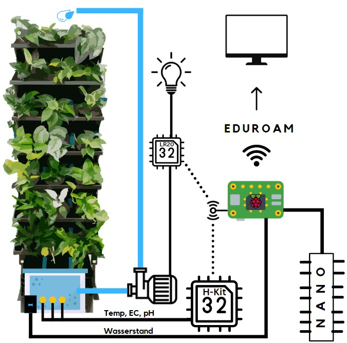
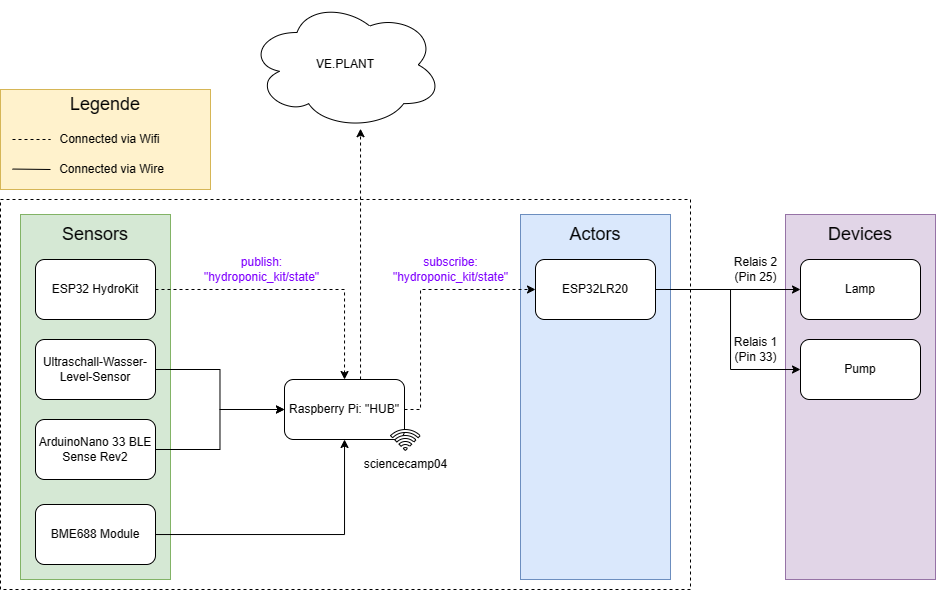

<a name="readme_top"></a>

# Sience Camp “Green2Smart” 2024

The "Green2Smart" 2024 science camp in Erfurt (Thuringia) organized by ProTELC, a project of the Thuringian Engineering Sciences Alliance, was all about AI-supported solutions for smart indoor greening. The task was to equip a mobile wall with plants and control them and their components by integrating AI. This made it possible to tap into the potential of combining modern technology and its use in the context of ecology.

## Known Issues

- USB-To-UART-Bridge drivers are not working for linux kernel modules 6 for now. (Tested on debian 12)
- getting the current time from the internet is not working, as we only have 1 wifi chip in the raspberry pi and it is used for the mqtt connection. (We could use a second wifi chip or use a cable connection to the internet to solve this issue if we would have more time.)
- the esp32lr20 actor resets mqtt connection every few seconds for some teams

<p align="right">(<a href="#readme_top">back to top</a>)</p>

## What you should know

- non-technical:

  - the plants should not be permanently exposed to draughts (e. g. not in the foyer!)
  - refill the water about every 2 weeks
  - water box should be washed out once every 6 months or so, as otherwise salts and dirt will settle on the fertilizer solution
  - if the plants compete for light (plants growing downwards vs. upwards), pruning may be necessary
  - top up not only with water, but also with fertilizer solution (if EC value is too low -> see [Website](https://sc2024.ve-plant.com/) for checking the values)
  - if a plant dies, you can cut off a shoot from another plant and put it back into the pot of the dead plant

- technical:

  - ⚠️ even when the power strip is switched off, 230V still flows through the relays of the ESP32LR20! (if the plugs of the lamp/pump are plugged in) ⚠️
  - the code for the raspberry pi is written by the team behind the "Green2Smart" science camp 2024 (we just implemented for getting the local time of the raspberry pi for now)
  - the ip of the raspberry pi is `192.168.20.1`
  - if you change something for the devices that are connected via wire and send serialize data, you have to reboot the raspberry pi to get the new data

    ```sh
    ssh pi@192.168.20.1

    sudo reboot
    ```

  - You can copy files from the pi like this: `scp -r pi@192.168.20.1:/home/pi/Documents/raspberry-pi-hub .`

<p align="right">(<a href="#readme_top">back to top</a>)</p>

## Getting Started

### Prerequisites

- Hardware you will need:
  - Raspberry Pi 4
  - ESP32 Hydroponics Kit
  - ESP32LR20
  - Arduino Nano BLE Sense Rev2
  - Raspberry Pi Module: BME688
- Software you will need:
  - Arduino IDE or VSCode (with PlatformIO)
  - [Additional Drivers (USB-To-UART-Bridge)](https://www.silabs.com/developers/usb-to-uart-bridge-vcp-drivers?tab=downloads) for working with the ESP32LR20

### Installation (for using Arduino IDE)

1. Clone the repository
   ```sh
   git clone https://github.com/MhouneyLH/green2smart.git
   ```
2. Open the Arduino IDE. (Make sure that you put the correct path in the preferences for the Arduino IDE to find the libraries.)
3. Open the .ino file in the Arduino IDE for the sensor / actor you want to develop with. (in `./src`)
4. Connect the sensor / actor to your computer.
5. Select the correct board and com port in the Arduino IDE.
6. Install needed libraries (if not already installed). (Just look at includes in the .ino file / error messages when compiling / the table below)

   | Sensor / Actor (name of directory in ./src) | Needed Arduino libraries                                       |
   | ------------------------------------------- | -------------------------------------------------------------- |
   | hydro_kit                                   | ArduinoJson, PubSubClient, Ezo_I2c_lib-master                  |
   | esp32lr20_actor                             | ArduinoJson, PubSubClient                                      |
   | arduino_nano_sensor                         | ArduinoJson, Arduino_APDS9960, Arduino_LPS22HB, Arduino_HS300x |

7. Upload the code to the sensor / actor.

## Architecture





<p align="right">(<a href="#readme_top">back to top</a>)</p>

## Used plants

| Plant                          | pH        | EC          |
| ------------------------------ | --------- | ----------- |
| Efeutute                       | `5,5-6,2` | `1-1,8`     |
| Scindapsus Pictus              | `5,0-6,5` | `(1,2-2,5)` |
| Philo Scandens                 | `5,5-6,2` | `1,2-2`     |
| Davallia mariesii ‘Microsorum’ | `5,5-6,5` | `1,0-2,0`   |
| Optimale Range                 | `5,5-6,0` | `1,2-1,8`   |
| Maximale Abweichung            | `+-0,5`   | `+-0,2`     |
| → Maximale Range               | `5,0-6,5` | `1,0-2,0`   |

<p align="right">(<a href="#readme_top">back to top</a>)</p>
